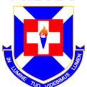

# EduShield

<p align="center">
  
</p>

<h1 align="center">EduShield</h1>

<p align="center">
  Secure • Monitor • Manage
</p>

<p align="center">
  A Mobile Device Management Platform Built for Schools, Organizations, and Enterprises
</p>

---

## About EduShield

EduShield is a powerful Android-based Mobile Device Management (MDM) platform designed to help educational institutions and organizations securely manage devices under their administration.

Built entirely in **Android Studio**, EduShield allows administrators to monitor device activity, enforce security policies, manage applications, control internet access, and oversee organization-owned devices through a centralized management system.

The platform is designed to improve productivity, enhance security, and simplify device administration across large groups of users.

---

## Developed By

EduShield was designed and developed by students of **Presbyterian Boys' Secondary School (PRESEC)** as an innovation project focused on cybersecurity, digital safety, and educational technology.

---

## Key Features

### QR-Based Organization Enrollment

* Join organizations instantly using QR codes
* Fast device onboarding
* Secure organization linking
* Simplified deployment process
* Multi-device organization support

### Device Monitoring

* Real-time device status tracking
* Device inventory management
* Online/offline monitoring
* Device identification and organization grouping

### Application Monitoring

* Track installed applications
* Log application launches
* Monitor application usage time
* Detect unauthorized applications
* Application activity reports

### Website Monitoring

* Log visited websites
* Track browsing activity
* Generate web usage reports
* Domain filtering and monitoring

### Application Control

* Application allowlists
* Application blocklists
* Restricted application policies
* Organization-wide application management

### Network Protection

* Built-in VPN integration
* Organization-controlled internet access
* Website filtering
* Domain blocking
* Secure traffic routing

### Activity Logging

* Application activity logs
* Website activity logs
* Device event history
* Administrative audit logs
* User activity timeline

### Administrative Dashboard

* Organization overview
* Device management interface
* Activity analytics
* Security monitoring
* Device compliance reports

### Security Features

* Device policy enforcement
* Restricted access controls
* Security alerts
* Device compliance monitoring
* Remote administrative actions

---

## Technology Stack

### Mobile Application

* Java
* Kotlin
* Android Studio
* Android SDK

### Backend Services

* REST APIs
* Authentication Services
* Database Services

### Security

* QR Authentication
* VPN Integration
* Encrypted Communications
* Role-Based Access Control

---

## System Workflow

```text
Administrator Creates Organization
                │
                ▼
      EduShield Generates QR Code
                │
                ▼
         User Scans QR Code
                │
                ▼
      Device Joins Organization
                │
                ▼
 Policy & Security Rules Applied
                │
                ▼
 Activity Monitoring Begins
```

---

## Use Cases

### Schools

* Student tablet management
* School laptop administration
* Classroom device monitoring
* Digital learning enforcement

### Universities

* Campus device management
* Student organization devices
* Academic resource protection

### Businesses

* Employee device management
* Corporate policy enforcement
* Productivity monitoring

### Organizations

* Device fleet management
* Security compliance
* Centralized administration

---

## Project Goals

* Improve digital security
* Simplify device management
* Reduce unauthorized software usage
* Protect organizational resources
* Improve productivity visibility
* Create safer digital learning environments

---

## Future Roadmap

* AI-powered threat detection
* Advanced analytics dashboard
* Cross-platform support
* Windows device management
* Remote device actions
* Cloud synchronization
* Real-time notifications
* Behavioral anomaly detection

---

## Contributors

Developed by students of

**Presbyterian Boys' Secondary School (PRESEC)**

Building innovative solutions for education, cybersecurity, and digital device management.

---

## License

Copyright © EduShield Team

All Rights Reserved.
